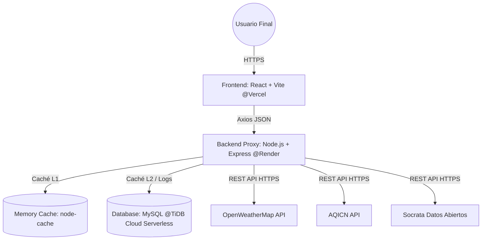

# 🏙️ Documento de Diseño y Arquitectura Técnica — CivicView

**Proyecto de Etapa Productiva**  
**Autor:** Jeyson Andrés Ortiz Mendoza  
**Programa:** Tecnólogo en Análisis y Desarrollo de Software (Ficha: 2675845)  
**Institución:** Servicio Nacional de Aprendizaje (SENA) — Centro Agroempresarial y Desarrollo Pecuario del Huila (Garzón)  
**Fecha:** Mayo 2026 | **Versión:** 1.0.0  
**Despliegue Frontend (Vercel):** [https://civicview.vercel.app](https://civicview.vercel.app)  
**Repositorio Git:** [https://github.com/andrewortiz89/civicview.git](https://github.com/andrewortiz89/civicview.git)

---

## 1. Resumen Ejecutivo
**CivicView** es un dashboard cívico centralizado en tiempo real diseñado para los ciudadanos y visitantes de Bogotá D.C. Consolida en una sola pantalla información crítica para planificar el día a día: condiciones climáticas, estado de la calidad del aire (ICA), restricciones vehiculares (Pico y Placa bajo la norma 2026), agenda cultural gratuita y un mapa interactivo con la red de ciclorutas y puntos de interés urbano (parques, bibliotecas de BibloRed, museos). 

Técnicamente, el sistema soluciona el problema de la **dispersión de información y latencia** mediante una arquitectura desacoplada: un cliente web SPA optimizado y un middleware en el servidor que actúa como API Gateway, capa de seguridad, normalizador de esquemas de datos y gestor de caché híbrido de dos niveles (memoria ram y persistencia SQL).

---

## 2. Arquitectura General del Sistema
CivicView implementa un modelo **Cliente-Servidor de Tres Capas** (Presentación, Aplicación y Datos) diseñado bajo los principios de desacoplamiento, resiliencia y alta performance.



### 2.1 Capa de Presentación (Frontend)
Desplegada en **Vercel**. Es una Single Page Application (SPA) construida con **React 18.3** y **Vite 5**.
* **Visualización de Mapas**: Utiliza **Leaflet.js** y **React-Leaflet** cargando datos geográficos en formato GeoJSON.
* **Estilos y Estética**: Usa **Tailwind CSS 3** en conjunto con un archivo de tokens personalizados (`nebula.css`) para implementar la estética **Neo-Táctil** (Dark mode nativo, glassmorphism, gradientes cívicos y bordes reactivos).
* **Gestión de Datos**: Consume exclusivamente los endpoints unificados del backend de CivicView usando **Axios**. Aplica almacenamiento en `localStorage` con TTLs locales en hooks personalizados para evitar parpadeos y llamadas redundantes.

### 2.2 Capa de Aplicación (Backend / Middleware)
Desplegada en **Render** (Web Service). Es una API REST construida con **Node.js** y **Express**. Actúa como:
1. **API Gateway / Proxy**: Centraliza el consumo de APIs de terceros (OpenWeatherMap, AQICN, Socrata) y oculta las credenciales (API Keys) del navegador.
2. **Capa de Resiliencia y Fallback**: Si una API externa falla, el backend implementa reintentos automáticos y finalmente sirve datos desde la base de datos o esquemas estáticos alternativos (Stale-While-Revalidate).
3. **Caché de Nivel 1**: Usa `node-cache` en memoria RAM para resolver peticiones idénticas en microsegundos (< 5 ms de tiempo de respuesta).
4. **Seguridad y Control de Tráfico**: Configurado con `Helmet` para inyectar cabeceras seguras, `CORS` habilitado de forma controlada y `Express-Rate-Limit` para prevenir ataques de denegación de servicio (DoS) a nivel de IP.

### 2.3 Capa de Datos (Base de Datos)
Alojada en **TiDB Cloud** (MySQL Serverless compatible con alta disponibilidad).
* Almacena datos parametrizables del sistema (ciudades habilitadas, proveedores de API y sus cuotas).
* Guarda la persistencia de caché secundaria (Caché L2) para dar soporte offline o tolerar fallas prolongadas de los proveedores externos.
* Registra analíticas y registros de consumo de APIs (`api_logs`) para auditoría de rendimiento y control del presupuesto mensual de llamadas.

---

## 3. Diseño y Estructura del Frontend
La interfaz de CivicView está basada en widgets que actúan como "cards de control cívico" independientes. 

### 3.1 Estructura del Proyecto Frontend
```
civicview-frontend/
├── public/                # Assets estáticos y manifiesto PWA
├── src/
│   ├── components/
│   │   ├── common/        # Header, Footer, Cards contenedoras, Loading spinners
│   │   ├── dashboard/     # Cards de Clima, Calidad del Aire, Pico y Placa, Eventos
│   │   └── map/           # Mapa interactivo y paneles laterales
│   ├── hooks/             # useWeather.js, useAirQuality.js, useEvents.js, usePicoPlaca.js
│   ├── pages/             # Home (Dashboard) y MapPage (Mapa Pantalla Completa)
│   ├── services/          # Clientes Axios y llamadas AJAX a backend
│   ├── utils/             # Constantes, reglas fijas de Pico y Placa y formateadores
│   ├── App.jsx            # Enrutador (React Router DOM)
│   ├── index.css          # Estilos base de Tailwind CSS
│   └── nebula.css         # Definición del sistema de diseño Neo-Táctil
```

### 3.2 Sistema de Diseño "Neo-Táctil"
Definido en [nebula.css](file:///c:/Users/USUARIO/civicview-frontend/src/nebula.css), utiliza variables CSS para garantizar la coherencia tipográfica y cromática:
```css
:root {
  --bg-primary: #0d1520;      /* Azul profundo oscuro */
  --bg-surface: #111c2d;      /* Superficie de tarjetas */
  --blue-glacial: #38b6ff;    /* Acento principal */
  --cyan-neon: #38dcc8;       /* Detalles y botones */
  --font-display: 'Syne', sans-serif;
  --font-num: 'Barlow Condensed', sans-serif;
}
```
* **Bordes reactivos**: Las tarjetas tienen un borde translúcido de `1px` con una transición de color hacia `--blue-glacial` y un resplandor (*glow effect*) al pasar el cursor (hover).
* **Tipografías semánticas**: Títulos en *Syne* para fuerza visual, valores numéricos (temperatura, ICA, placa) en *Barlow Condensed* para legibilidad rápida.

---

## 4. Diseño del Backend y Base de Datos

### 4.1 Base de Datos: Schema Relacional (TiDB / MySQL)
La base de datos contiene 10 tablas orientadas a parametrización, almacenamiento de logs e infraestructura de caché:

```
+-------------------+       +-----------------------+       +-------------------+
|      cities       | 1---N |     weather_cache     |       |   api_providers   |
+-------------------+       +-----------------------+       +-------------------+
| id (PK)           |       | id (PK)               |       | id (PK)           |
| name              |       | city_id (FK)          |       | name              |
| country           |       | temperature           |       | service_type      |
| latitude          |       | forecast (JSON)       |       | base_url          |
| longitude         |       | timestamp             |       | rate_limit_day    |
| timezone          |       +-----------------------+       | priority          |
+-------------------+                                       | is_active         |
        | 1                                                 +-------------------+
        |                                                             | 1
        | 1---N +-----------------------+                             |
        +-------|   air_quality_cache   |                             |
        |       +-----------------------+                             |
        |       | id (PK)               |                             |
        |       | city_id (FK)          |                             |
        |       | aqi_value             |                             |
        |       | timestamp             |                             |
        |       +-----------------------+                             |
        |                                                             |
        | 1---N +-----------------------+                             | 1---N
        +-------|     events_cache      |                             |
        |       +-----------------------+                             |
        |       | id (PK)               |                             |
        |       | city_id (FK)          |                             |
        |       | title                 |                             |
        |       | event_date            |                             |
        |       +-----------------------+                             |
        |                                                             |
        | 1---N +-----------------------+       +------------------+  |
        +-------|       api_logs        |N-----1|  api_providers   |--+
                +-----------------------+       +------------------+
                | id (PK)               |
                | api_provider_id (FK)  |
                | status_code           |
                | cache_hit (BOOL)      |
                | response_time (ms)    |
                +-----------------------+
```

### 4.2 Procedimientos Almacenados Destacados
* **`clean_expired_cache`**: Ejecuta una limpieza periódica de registros de caché antiguos y depura los logs de más de 30 días para prevenir el crecimiento desmesurado de la base de datos:
  ```sql
  CREATE PROCEDURE clean_expired_cache()
  BEGIN
    DELETE FROM api_cache WHERE expires_at < NOW();
    DELETE FROM weather_cache WHERE timestamp < DATE_SUB(NOW(), INTERVAL 7 DAY);
    DELETE FROM air_quality_cache WHERE timestamp < DATE_SUB(NOW(), INTERVAL 7 DAY);
    DELETE FROM events_cache WHERE end_date < DATE_SUB(NOW(), INTERVAL 30 DAY);
    DELETE FROM api_logs WHERE timestamp < DATE_SUB(NOW(), INTERVAL 30 DAY);
  END;
  ```

### 4.3 Vistas de Análisis
* **`api_statistics`**: Consolida métricas clave agregadas por proveedor para calcular el porcentaje de llamadas exitosas y el impacto real del caché en los últimos 30 días.
* **`api_rate_limit_status`**: Expone en tiempo real qué porcentaje de la cuota diaria y horaria permitida ha consumido cada proveedor externo.

---

## 5. Integración con APIs y Flujo de Datos

### 5.1 Proveedores de Datos
1. **Clima**: OpenWeatherMap API (1.000 llamadas gratuitas al día). Almacenamiento en caché por 1 hora.
2. **Calidad del Aire**: AQICN API (1.000 llamadas al día). Almacenamiento en caché por 1 hora.
3. **Eventos Culturales**: Datos Abiertos Bogotá (Socrata API). No requiere credenciales. Almacenamiento en caché por 24 horas. Respaldado por Ticketmaster y un dataset en memoria si las APIs fallan.
4. **Pico y Placa (Bogotá 2026)**: No consume APIs externas. El cálculo se realiza de manera determinista y local en JavaScript mediante reglas preestablecidas de paridad de fecha y horarios definidos por el Decreto Distrital de Movilidad.

### 5.2 Estrategia de Caché e Hilo de Ejecución de Petición
Cuando el cliente solicita datos (ej: Clima):
1. El Frontend consulta su `localStorage` local. Si está vigente, renderiza de inmediato.
2. Si expiró, envía petición al Backend `GET /api/weather`.
3. El Backend busca la clave en `node-cache` (RAM). Si existe, responde inmediatamente (Latencia: ~3ms).
4. Si no está en RAM, busca en la base de datos (`weather_cache`) si existe un registro válido con antigüedad inferior a 1 hora. Si lo hay, lo carga a RAM y responde.
5. Si no hay datos válidos en base de datos, llama a la API de OpenWeatherMap.
   * Si la API responde OK: Normaliza los datos, los escribe en la DB, los guarda en RAM de `node-cache` y responde.
   * Si la API falla o está caída: Recupera el último dato de clima almacenado en la base de datos (incluso si tiene más de 1 hora de antigüedad), añade un flag `stale: true` para avisar al usuario del estado desactualizado y responde de manera resiliente.

---

## 6. Variables de Entorno

### 6.1 Frontend (`.env`)
```env
# URL de conexión al backend
VITE_BACKEND_URL=https://civicview-backend.onrender.com/api
```

### 6.2 Backend (`.env`)
```env
# Puerto del servidor
PORT=5000
NODE_ENV=production

# Base de datos (TiDB Cloud / MySQL)
DB_HOST=gateway01.us-east-1.prod.aws.tidbcloud.com
DB_PORT=4000
DB_USER=xxxxxx.root
DB_PASSWORD=xxxxxxxxxxxxxxxx
DB_NAME=civicview_db
DB_SSL_REJECT_UNAUTHORIZED=true

# API Keys de proveedores
OPENWEATHER_API_KEY=tu_api_key_de_openweather
AQICN_API_KEY=tu_api_key_de_aqicn
TICKETMASTER_API_KEY=tu_api_key_de_ticketmaster
```

---

## 7. Instrucciones para Ejecución Local

### 7.1 Requisitos Previos
* Node.js v20 o superior instalado.
* Base de datos MySQL (local o en la nube) corriendo.

### 7.2 Configuración del Backend
1. Navegar a la carpeta del backend: `cd backend`
2. Instalar dependencias: `npm install`
3. Copiar `.env.example` a `.env` y configurar credenciales y base de datos.
4. Ejecutar el script SQL del archivo [database/schema.sql](file:///c:/Users/USUARIO/civicview-frontend/database/schema.sql) en el gestor de base de datos.
5. Iniciar en modo desarrollo: `npm run dev`

### 7.3 Configuración del Frontend
1. Abrir una nueva terminal en la raíz del proyecto.
2. Instalar dependencias: `npm install`
3. Copiar `.env.example` a `.env` y configurar `VITE_BACKEND_URL`.
4. Iniciar servidor de desarrollo Vite: `npm run dev`
5. Abrir el navegador en `http://localhost:5173`
